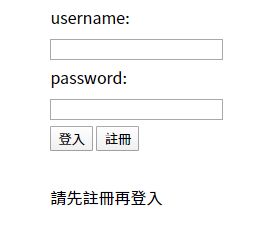
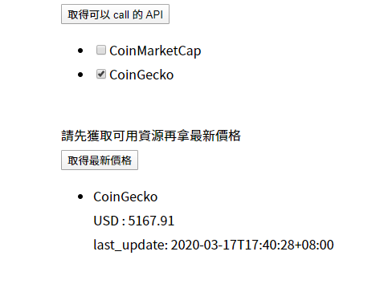
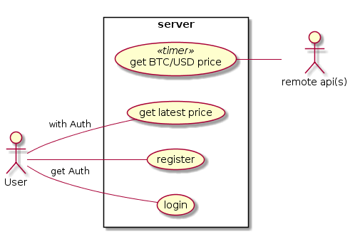
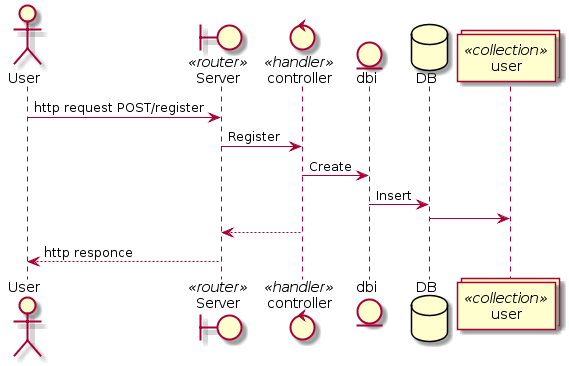
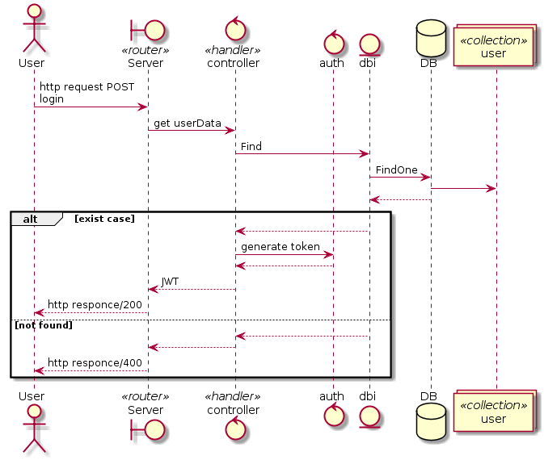
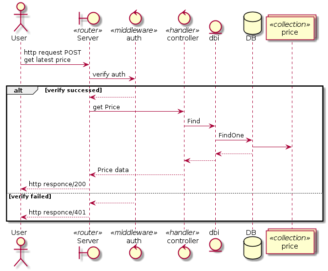
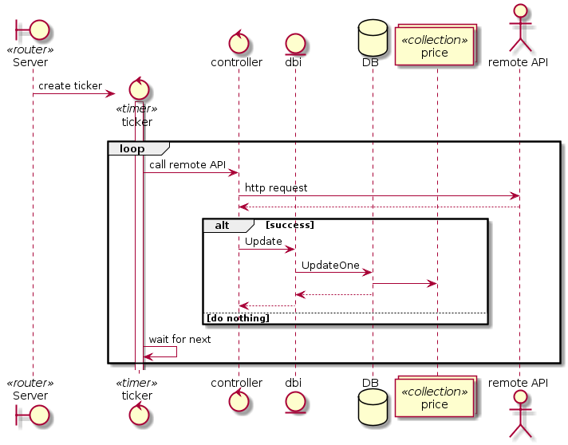
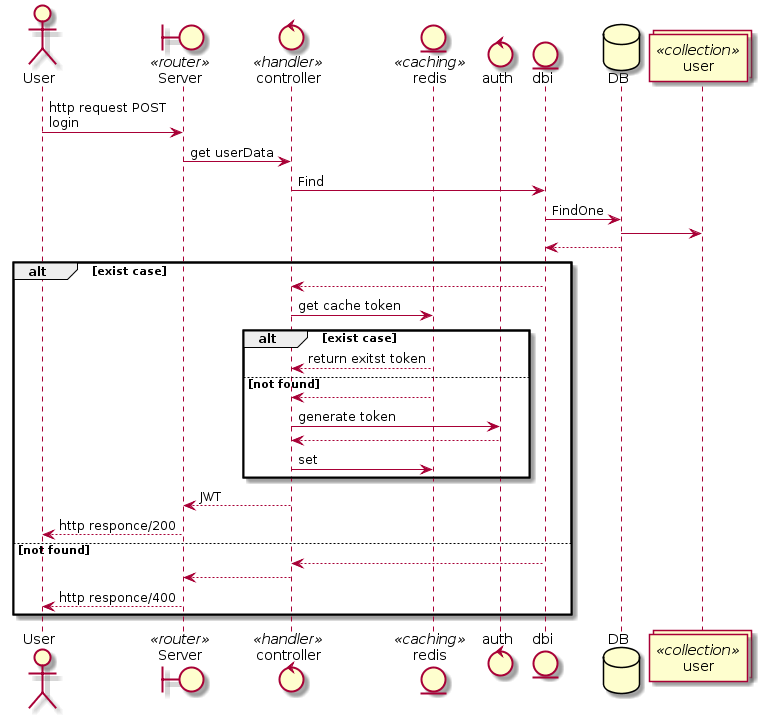

# BTC/USE price RESTful server based on golang

[](https://www.codefactor.io/repository/github/omegaatt36/btc-price-restful)
[](https://goreportcard.com/report/github.com/omegaatt36/btc-price-restful)
[](/LICENSE)

## Feature

- A RESTful  web-API server to get BTC/USD
- Based on golang
- Traffic control by each user have 5000 query times
- User can choose all sources or get active sources
- Use mongo db to save data for make report chart (todo)
- use redis as caching system for descrease latency

## How to use

### using docker

You can type `docker-compose up` in cli. If mongo and redis are ready to work, the server is ready for operation.

Or if you env have both of mongo and redis, you can build image using Dockerfile.

### check it work

All API docuument was placed in the [`docs/API.md`](docs/API.md). You can use `POSTMAN` of somthing to call apis.

Or you can try the simple web-client at `/web/index.html`



Then after register and login, you can easier to use this api server like this.



## demand analysis

### required

- based on golnag
- The API interface you provide can be any of the following：RESTful、json rpc、gRPC
  - choose restful
- At least two sources
- When a source is unavailable, the result of its last successful ask is returned
- Use git to manage source code
- Write readme.md and describe what features, features, and TODO which have been implemented

### optional

- Traffic limits, including the number of times your server queries the source, and the number of times the user queries you
- Good testing, annotations, and git commit
- An additional websocket interface is provided to automatically send the latest information whenever the market changes
- Users can choose to use an automatic source determination, the latest data source, or manually specify the source of the data
- Package it as a Dockerfile, docker-compose file, or kubernetes yaml
- There is a simple front-end or cli program that displays the results
- The API you provide has a corresponding file, such as a swagger, or simply a markdown file
- Other features not listed but that you thought would be cool to implement

### uaecase diagram



### sequence diagram

#### register



#### login



#### user get latest price



#### server get remote price



### sequence diagram with caching mechanism

If time permits, an caching mechanism will be added redis based

#### login with redis



#### user get latest price with redis


## intro

### http router

Use [`gorilla/mux`](https://github.com/gorilla/mux) as http router.

A struct `route` for registering

```go
type route struct {
	Method     string
	Pattern    string
	Handler    http.HandlerFunc
	Middleware mux.MiddlewareFunc
}

var routes []route
```

make a fuction `init` to initialize routes.

```go
func init() {
  register("GET", "/", handler, nil)
  ...
}

func register(method, pattern string, handler http.HandlerFunc, middleware mux.MiddlewareFunc) {
	routes = append(routes, route{method, pattern, handler, middleware})
}
```

now when you create a new `mux`, should use this handler like this.

```go
func NewRouter() *mux.Router {
	r := mux.NewRouter()
	for _, route := range routes {
		if route.Middleware == nil {
			r.HandleFunc(route.Pattern, route.Handler).Methods(route.Method)
		} else {
			r.Handle(route.Pattern, route.Middleware(route.Handler)).Methods(route.Method)
		}
	}
	return r
}
```

Also can write a test file and use [`appleboy/gofight`](https://github.com/appleboy/gofight) to make sure your router work normally.

```go
func TestGetDefault(t *testing.T) {
	route := gofight.New()
	route.GET("/").
		Run(routes.NewRouter(), func(res gofight.HTTPResponse, rq gofight.HTTPRequest) {
			assert.Equal(t, "btc-price-restful", res.Body.String())
			assert.Equal(t, http.StatusOK, res.Code)
		})
}
```

### database

All of result data which will be responsed by romote API server have simple structure. Just key-value JSON. So I choose NoSQL database official [`mongodb`](https://github.com/mongodb/mongo-go-driver) package to make storage.

You can use context to ensure the gorutine context will end at the same time. If the mongodb can't connect, the program will fatal error and exit.

```go
ctx, cancle := context.WithTimeout(context.Background(), 10*time.Second)
// ensure cancle function will be executed
defer cancle()
client, err := mongo.Connect(ctx, clientOptions())
if err != nil {
	l.Fatal(err) // l for logrus
}
db.SetClint(client)
```

the clientOptions is for docker, can set parameter for different env in dockerfile or docker-compose file.

```go
func clientOptions() *options.ClientOptions {
	host := "db"
	if os.Getenv("profile") != "prod" {
		host = "localhost"
	}
	return options.Client().ApplyURI(
		"mongodb://" + host + ":27017",
	)
}
```

### Register & Login

Using [`crypto/bcrypt`](https://godoc.org/golang.org/x/crypto/bcrypt) to encode password. Then save them into database. When user login, generate the JSON-Web-Token via [`dgrijalva/jwt-go`](https://github.com/dgrijalva/jwt-go). User can use this token to access service.

```go
func GenerateToken(user *models.User) (string, error) {
	token := jwt.NewWithClaims(jwt.SigningMethodHS256, jwt.MapClaims{
		"user_name": user.UserName,
	})
	return token.SignedString(secret)
}
```

### get remote API

#### decode plan

Before I do some service, I should to preview other server's API document like [coinmarketcap's dev docs](https://coinmarketcap.com/api/documentation/v1/). And try to decode json data form their server. You can see the example data from coinmarketcap website.

```json
{
    "status": {
		...
    },
    "data": [
        {
			...
            "quote": {
                "USD": {
					"price": 5050.98607739,
					...
                }
            }
        }
    ]
}
```

There is two way to decode json, by "to struct" or "to map".

##### json to struct

```go
type coinmarketcapStatus struct {
	Timestamp string `json:"timestamp"`
}

type coinmarketcapUSD struct {
	Price float64 `json:"price"`
}

type coinmarketcapQuote struct {
	USD coinmarketcapUSD `json:"USD"`
}

type coinmarketcapData struct {
	Quote coinmarketcapQuote `json:"quote"`
}

type coinmarketcap struct {
	Status coinmarketcapStatus `json:"status"`
	Data   []coinmarketcapData `json:"data"`
}

func byUnmarshal(str string) float64 {
	var coin coinmarketcap
	err := json.Unmarshal([]byte(str), &coin)
	if err != nil {
		fmt.Errorf("Can not decode data: %v\n", err)
	}
	return coin.Data[0].Quote.USD.Price
}
```

##### json to map

```go
func byJSONToMap(str string) float64 {
	var mapResult map[string]interface{}
	err := json.Unmarshal([]byte(str), &mapResult)
	if err != nil {
		panic(err)
	}
	USD, _ := mapResult["data"].([]interface{})[0].(map[string]interface{})["quote"].(map[string]interface{})["USD"].(map[string]interface{})["price"]
	return USD.(float64)
}
```

And we can benchmark these code by using `go test -bench=.`

```go
func BenchmarkByUnmarshal(b *testing.B) {
	for i := 0; i < b.N; i++ {
		byUnmarshal(jsonStr)
	}
}

func BenchmarkByJSONToMap(b *testing.B) {
	for i := 0; i < b.N; i++ {
		byJSONToMap(jsonStr)
	}
}
BenchmarkByUnmarshal-4            141256             10535 ns/op
BenchmarkByJSONToMap-4            100056             20537 ns/op
PASS
ok      mondb_practice  4.076s
```

Finally you can see use "to struct" may write more code to define the data structure but use less time. So I deside use this plan to decode.

#### several source

We can call several API to get current price, and we can use smarter way to get these. So I choose factory method pattern to let the thing easier If I add more source.

We can write "abstract class" in `remote/abstract.go` like this.

```go
type Response interface {
	GetUSD() float64
}

type responseAttribute struct {
	usd float64
}

type responseFactory interface {
	Create(string) (Response, error)
}
```

Then implement a "sub class".

```go
type CoinMarketCapFactory struct{}

func (CoinMarketCapFactory) Create(str string) (Response, error) {
	var cmc coinmarketcapResponse
	err := json.Unmarshal([]byte(str), &cmc)
	if err != nil {
		return nil, err
	}
	return &coinMarketCap{
		responseAttribute: &responseAttribute{
			usd: cmc.Data[0].Quote.USD.Price,
		},
	}, nil
}

type coinMarketCap struct {
	*responseAttribute
}
func (cmc coinMarketCap) GetUSD() float64 {
	return cmc.usd
}
```

#### try to get one source result

We can refactor the API to get latest data. If you want to see more, can review `remote/coinmarketcap.go`

```go
type API interface {
	GetUSD() float64
	GetSourceName() string
	GetLastestID() (primitive.ObjectID, error)
	CallRemote() error
	InsertDB() error
}

type responseAttribute struct {
	sourceName string
	usd        float64
	timestamp  string
	latestID   primitive.ObjectID
	authKey    string
}
```

#### ticker

Finally in this part, we can hide the personal auth key into `APIconf.json` like this. 

```json
{
    "sourceName": {
        "auth":"auth token",
        "delay" : 300
    }
}
```

Then make ticker to call API automatically.

```go
func runTicker(api API) {
	name := api.GetSourceName()
	d := time.Duration(time.Second * time.Duration(apiConfigs[name].Delay))
	ticker := time.NewTicker(d)
	defer ticker.Stop()
	for {
		<-ticker.C
		err := api.CallRemote()
		if err != nil {
			logrus.Info(err.Error())
			continue
		}
		err = api.InsertDB()
		if err != nil {
			logrus.Info(err.Error())
			continue
		}
		logrus.Debug("%s get new data", name)
	}
}
```

### service

Make two handler in controllers and hook in routers

```go
func GetServiceMap(w http.ResponseWriter, r *http.Request) {
	keys, _ := db.RedisKeysByNameSpace(db.NSLatestAPI)
	utility.ResponseWithJSON(w, http.StatusOK, utility.Response{Result: utility.ResSuccess, Data: keys})
}
func GetLatestPrice(w http.ResponseWriter, r *http.Request) {
	result := make(map[string]models.Price)
	services := strings.Split(mux.Vars(r)["service"], ",")
	for _, service := range services {
		var price models.Price
		result[service] = price

	}
	utility.ResponseWithJSON(w, http.StatusOK, utility.Response{Result: utility.ResSuccess, Data: result})
}
```

### auth middleware

make a middleware to verify user token before processing service.

```go
register("GET", "/getServiceMap", controllers.GetServiceMap, auth.TokenMiddleware)
register("GET", "/getLatestPrice/{service}", controllers.GetLatestPrice, auth.TokenMiddleware)

if route.Middleware == nil {
	r.HandleFunc(route.Pattern, route.Handler).Methods(route.Method)
} else {
	r.Handle(route.Pattern, route.Middleware(route.Handler)).Methods(route.Method)
}
```

### CORS

Finally you must add CORS handler if you want to other people can call you api in browser.

```go
allowedHeaders := handlers.AllowedHeaders([]string{"Content-Type", "Authorization"})
allowedOrigins := handlers.AllowedOrigins([]string{"*"})
allowedMethods := handlers.AllowedMethods([]string{"GET", "POST", "OPTIONS"})
n.UseHandler(handlers.CORS(allowedHeaders, allowedOrigins, allowedMethods)(mux))
```